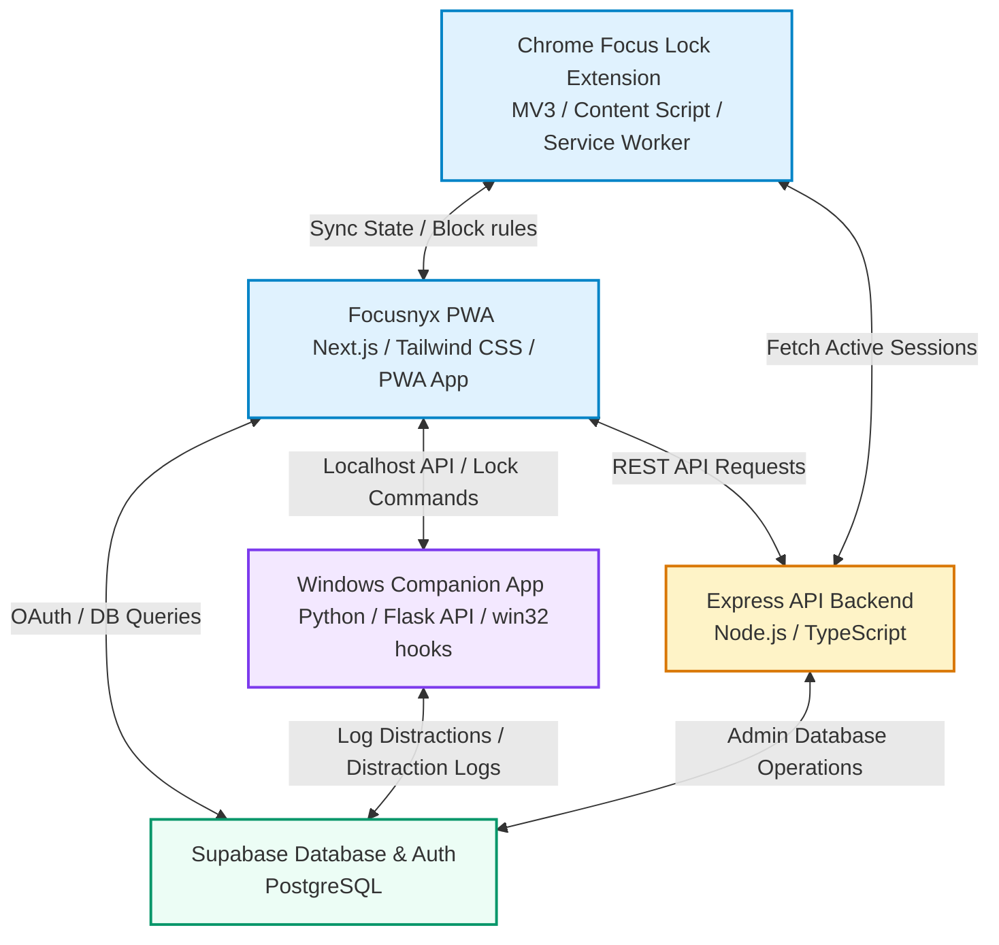
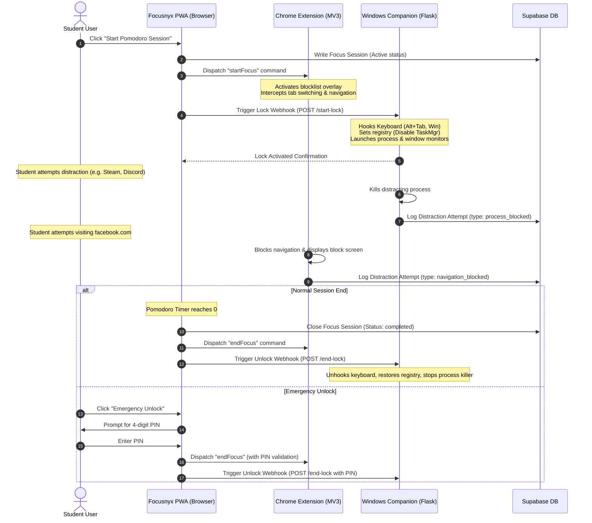

<!--
  Focusnyx - Premium README File
  Crafted to represent the definitive repository documentation.
-->

# <p align="center"><br>Focusnyx</p>

<p align="center">
  <strong>The Ultimate Student Life OS & Cognitive Shield</strong>
</p>

<p align="center">
  <a href="https://opensource.org/license/apache-2-0"></a>
  <a href="https://nextjs.org/"></a>
  <a href="https://expressjs.com/"></a>
  <a href="https://supabase.com/"></a>
  <a href="https://developer.chrome.com/docs/extensions/mv3/intro/"></a>
  <a href="https://www.python.org/"></a>
  <a href="https://windows.microsoft.com/"></a>
</p>

---

## 📖 Table of Contents
- [Project Overview](#-project-overview)
- [Key Features & Core Modules](#-key-features--core-modules)
  - [Smart Academic Forge](#1-smart-academic-forge)
  - [Dopamine Detox Engine](#2-dopamine-detox-engine)
  - [Smart Notes Vault with AI Quiz Generator](#3-smart-notes-vault-with-ai-quiz-generator)
  - [AI Behavioral Coach & Focusnyx AI Chatbot](#4-ai-behavioral-coach--focusnyx-ai-chatbot)
  - [Student Finance Tracker](#5-student-finance-tracker)
  - [Wellness Shield](#6-wellness-shield)
  - [3-Tier Productivity Analytics](#7-3-tier-productivity-analytics)
- [System Architecture & Data Flows](#%EF%B8%8F-system-architecture--data-flows)
  - [High-Level Architecture](#high-level-architecture)
  - [Pomodoro Detox Lock Sync Flow](#pomodoro-detox-lock-sync-flow)
- [Database Schema (Supabase / Postgres)](#-database-schema-supabase--postgres)
- [Code Structure & Modular Design](#-code-structure--modular-design)
- [Compatibility & Hardware Hooks](#-compatibility--hardware-hooks)
- [Installation & Local Setup](#%EF%B8%8F-installation--local-setup)
- [Manual Screenshot Contribution Guidelines](#%EF%B8%8F-manual-screenshot-contribution-guidelines)

---

## 🌟 Project Overview

**Focusnyx** is a modern, enterprise-ready **Student Life OS** and digital cognitive shield designed specifically for university students. Operating as a hybrid system, it merges a Next.js Progressive Web App (PWA) with a Chrome Web Extension (Manifest V3) and a native Windows Python Companion. Focusnyx helps students manage their GPA, tracks wellness indicators, maintains budgets, and enforces a strict, distraction-free **Dopamine Detox** by locking down web browsers and OS environments during focus intervals.

---

## 🛠️ Key Features & Core Modules

### 1. Smart Academic Forge
An academic powerhouse that tracks your semester progression and studies:
- **GPAs Momentum Estimator**: Input semester course target grades and actual mid-term/finals marks. Estimate SGPAs and project overall CGPAs.
- **Academic Tasks**: Manage study items, exams, and projects with integrated subtasks and completion weights.
- **Gamified Rewards**: Complete tasks to earn Experience Points (XP) and build streaks, leveling up your profile.

---
> [!NOTE]
> **[UI Screenshot Guide]** Place a screenshot of the *Academic Forge Page* here.
> File path: `/docs/assets/screenshots/academic_forge.png`
---

### 2. Dopamine Detox Engine
A strict, dual-layer concentration lock designed to interrupt feedback loops from instant gratification apps:
- **Browser Lock (Chrome Extension)**: Intercepts web navigation, tab switches, and new tab creations. Redirects unallowed domains back to Focusnyx with custom-injected overlays.
- **Operating System Lock (Windows Companion)**: Hooking system intercepts productivity-breaking shortcuts (e.g., `Alt+Tab`, `Windows Key`, `Ctrl+Esc`), disables Task Manager / Registry Editor via user-mode keys, and forcefully minimizes non-browser apps.
- **Locked Browser Enforcement**: Forces Chrome/Edge to stay "Always-on-Top" using active Win32 window handles.
- **Emergency Rescue PIN**: Prevents impulsive exits. The only way to stop a focus lock session prematurely is to enter a pre-configured 6-digit emergency PIN, logging it as an escape event.

---
> [!NOTE]
> **[UI Screenshot Guide]** Place a screenshot of the *Detox Engine Active Lock State* here.
> File path: `/docs/assets/screenshots/dopamine_detox_lock.png`
---

### 3. Smart Notes Vault with AI Quiz Generator
A study-focused notes assistant that transforms typing and speech into active recall materials:
- **Continuous Voice Notes (Speech-to-Text)**: Leverages the Web Speech API (`webkitSpeechRecognition`) for hands-free study recording. Full bilingual support for English (US) and Bangla (BD) with an automatic audio processing engine to prevent infinite loops.
- **AI Quiz Generator**: Generates custom practice sets from note contents via Llama-3.1 or Gemini. 
  - **Interactive MCQs**: Includes live score indicators, instant option feedback (correct/incorrect styling), and comprehensive explanations.
  - **Short Q&A practice**: Flashcard style cards for quick conceptual checks.
  - **Broad essay-style questions**: Prepare for university examinations with full structural model answers.

---
> [!NOTE]
> **[UI Screenshot Guide]** Place a screenshot of the *Smart Notes Dashboard & Quiz Panel* here.
> File path: `/docs/assets/screenshots/smart_notes_quiz.png`
---

### 4. AI Behavioral Coach & Focusnyx AI Chatbot
An intelligent coaching layer providing structural cognitive behavioral therapy (CBT) inspired guidance:
- **Focusnyx AI Chatbot**: A floating assistant embedded globally in the App Shell layout.
- **Knowledge Boundaries**: Governed by strict system prompts. It only answers questions related to Focusnyx app features, productivity, study habits, and academic topics. Politely declines off-topic prompts (e.g., celebrity gossip, gaming, movies, politics) in English or Bangla.
- **Free Tier Restrictions**: Implements client-side counters and Supabase backend updates to restrict users to a limit of 5 requests daily (resetting according to Bangladesh Standard Time - Asia/Dhaka).
- **Custom API Key Fallback**: Users can paste their personal Groq or Gemini keys in Settings to enjoy unlimited AI chat services.
- **Weekly Progress Coach**: Correlates notes, finance categories, completed tasks, wellness sleep patterns, and logs of distraction incidents to construct comprehensive weekly reports and behavioral feedback.

---
> [!NOTE]
> **[UI Screenshot Guide]** Place a screenshot of the *Focusnyx AI Floating Chatbot UI* here.
> File path: `/docs/assets/screenshots/ai_chatbot.png`
---

### 5. Student Finance Tracker
A lightweight micro-budget ledger designed to alleviate student financial stress:
- **Transactions**: Log income and expenses across custom categories.
- **Monthly Budgets**: Establish spending limits with real-time progress indicators.
- **Lent/Borrowed Debts**: Keep track of pending loans with peers, tracking settled/unsettled statuses.
- **Savings Goals**: Plan for devices or tuition, adding deposits and tracking target timelines.

### 6. Wellness Shield
Maintains awareness of physiological wellness alongside study logs:
- **Sleep & Mood Tracker**: Log sleep hours and subjective moods.
- **Work-Rest Balance**: Graphically visualizes ratios of study hours against rest intervals, identifying burnout thresholds.

### 7. 3-Tier Productivity Analytics
Transforms passive logs into behavioral insights:
1. **Tier 1 (Daily Dashboard)**: Displays today's XP gains, task completions, and active focus time.
2. **Tier 2 (Weekly Analysis)**: Displays distraction log categories, frequency of blocked websites, and sleep duration ratios.
3. **Tier 3 (Macro Patterns)**: Reveals correlation tables showing how hours slept affect student focus scores and SGPA.

---

## ⚙️ System Architecture & Data Flows

### High-Level Architecture

The diagram below details the integration between client applications, background processes, backend APIs, and the database:



---

### Pomodoro Detox Lock Sync Flow

The lifecycle of a distraction-free Pomodoro session across the PWA, Chrome Extension, and Windows Companion:



---

## 🗄️ Database Schema (Supabase / Postgres)

Focusnyx utilizes a PostgreSQL schema managed via Supabase. Below is a structural outline of the database relations:

```
  ┌──────────────────┐          ┌───────────────────┐
  │     profiles     │◀─────────│  academic_tasks   │
  ├──────────────────┤          ├───────────────────┤
  │ id (PK, FK)      │          │ id (PK)           │
  │ university_email │          │ user_id (FK)      │
  │ display_name     │          │ title             │
  │ preferred_lang   │          │ subject           │
  │ level, total_xp  │          │ subtasks (jsonb)  │
  │ streak, score    │          │ due_at            │
  └──────────────────┘          └───────────────────┘
           ▲
           │                    ┌───────────────────┐
           ├───────────────────│       notes       │
           │                    ├───────────────────┤
           │                    │ id (PK)           │
           │                    │ user_id (FK)      │
           │                    │ subject, content  │
           │                    │ source            │
           │                    └───────────────────┘
           │
           │                    ┌───────────────────┐
           ├───────────────────│  focus_sessions   │
           │                    ├───────────────────┤
           │                    │ id (PK)           │
           │                    │ user_id (FK)      │
           │                    │ started_at        │
           │                    │ planned_minutes   │
           │                    └───────────────────┘
           │
           │                    ┌───────────────────┐
           └───────────────────│ distraction_logs  │
                                ├───────────────────┤
                                │ id (PK)           │
                                │ user_id (FK)      │
                                │ domain, type      │
                                │ details (jsonb)   │
                                └───────────────────┘
```

### Table Definitions

1. **`profiles`**
   - Stores user progress, gamification variables, and custom AI configurations.
   - Primary key `id` references Supabase auth user system.
   - Key attributes: `university_email`, `total_xp`, `streak`, `focus_score`, `emergency_pin`.

2. **`academic_tasks` & `academic_courses`**
   - Manage courses, grade trackers, and student task boards.
   - `subtasks` is stored as a JSONB array for lightweight client nested parsing.

3. **`focus_sessions` & `distraction_logs`**
   - Stores active sessions and records blocked events (processes, websites) for productivity metrics.

4. **`notes`**
   - Manages notes content, tag mappings (`subject`), and audit records representing whether the source is `typed` or `voice-whisper`.

5. **`transactions`, `budgets`, `debts`, `savings_goals`**
   - Track ledger movements, month limit aggregates, peer-lent logs, and goal deadlines.

---

## 📂 Code Structure & Modular Design

Focusnyx uses a highly modular monorepo structure designed for clarity and reusability:

```
Focusnyx/
├── backend/                  # REST API server (Express / TypeScript)
│   ├── src/
│   │   ├── config/           # App settings and environment verification
│   │   ├── controllers/      # Route handler controllers
│   │   ├── middleware/       # JWT auth & error interceptors
│   │   ├── routes/           # Domain-split routers (academic, wellness, etc.)
│   │   └── services/         # Third-party integrations (Supabase, Resend)
│   └── supabase/             # Database migration and SQL schema
│
├── frontend/                 # Progressive Web Application (Next.js 14 App Router)
│   ├── public/               # Static icons, audio assets, and PWA manifest
│   ├── src/
│   │   ├── app/              # Folder-based pages (dashboard, notes, finance)
│   │   ├── components/       # Reusable Neo-brutalist UI components
│   │   ├── context/          # Global focus locks and language states
│   │   └── hooks/            # Custom hooks (e.g. Speech-to-text hooks)
│
├── extension/                # Focus Lock Chrome Extension (Manifest V3)
│   ├── manifest.json         # Extension permissions and scope filters
│   ├── blocked.html          # Custom redirect blockpage layout
│   └── src/
│       ├── background/       # Tab interceptions and background listener
│       └── content/          # Content scripts and DOM overlay injections
│
└── companion/                # Windows Focus Lock Companion App (Python 3.9)
    ├── focusnyx_companion.py # Main system tray lifecycle, Flask loop, hooks
    ├── keyboard_blocker.py   # Windows low-level keyboard hooks hooker
    ├── registry_manager.py   # Task Manager & Registry locker (user keys)
    ├── process_monitor.py    # Native process scanner and process killer
    └── window_manager.py     # Win32 window always-on-top focus manager
```

---

## 💻 Compatibility & Hardware Hooks

Focusnyx achieves high system reliability without requiring kernel-level drivers:

| Component | Target System | Hook Mechanism | Permissions |
| :--- | :--- | :--- | :--- |
| **PWA Web App** | Web Browsers / Mobile | Service Workers, Web Speech API | Mic, Push Notifications |
| **Chrome Extension** | Chrome / Edge / Chromium | `chrome.webRequest`, `chrome.tabs` | `webRequest`, `storage`, `<all_urls>` |
| **Companion App** | Windows 10 & 11 | `win32gui`, `win32process`, `keyboard` | Windows User-level (no Admin needed) |

- **Registry Editor Locking**: Instead of global machine paths, the Companion writes to the user profile path `HKEY_CURRENT_USER\SOFTWARE\Microsoft\Windows\CurrentVersion\Policies\System` to disable Task Manager. This prevents authorization prompts.
- **Always-On-Top Browser**: Keeps browser focus by calling `SetWindowPos` from the Win32 API repeatedly inside a window check thread.

---

## 🚀 Installation & Local Setup

### Prerequisites
- [Node.js v18+](https://nodejs.org/en)
- [Python v3.9+](https://www.python.org/) (specifically for Windows devices)
- [Git](https://git-scm.com/)

---

### Step 1: Clone and Database Setup
1. Clone the repository to your system:
   ```bash
   git clone https://github.com/your-username/Focusnyx.git
   cd Focusnyx
   ```
2. Create a project at [Supabase](https://supabase.com/).
3. Open the **SQL Editor** in your Supabase Dashboard, copy the contents of [schema.sql](file:///e:/Users/Desktop/AI%20PROJECT/Focusnyx/backend/supabase/schema.sql) and run it to set up all tables and indexes.

---

### Step 2: Configure and Start the Backend
1. Navigate to the backend directory:
   ```bash
   cd backend
   ```
2. Create your `.env` file using the example:
   ```bash
   cp .env.example .env
   ```
3. Open `.env` and fill in your Supabase credentials:
   - `PORT=8080`
   - `SUPABASE_URL=your_supabase_project_url`
   - `SUPABASE_SERVICE_ROLE_KEY=your_supabase_service_role_secret`
   - `GROQ_API_KEY=your_groq_api_key_here` (Optional)
4. Install dependencies and start the development server:
   ```bash
   npm install
   npm run dev
   ```

---

### Step 3: Configure and Start the PWA Frontend
1. Navigate to the frontend directory:
   ```bash
   cd ../frontend
   ```
2. Create your `.env.local` file:
   ```bash
   cp .env.example .env.local
   ```
3. Configure your API keys in `.env.local`:
   - `NEXT_PUBLIC_SUPABASE_URL=your_supabase_project_url`
   - `NEXT_PUBLIC_SUPABASE_ANON_KEY=your_supabase_anon_public_key`
4. Install dependencies and start the development server:
   ```bash
   npm install
   npm run dev
   ```
5. Open [http://localhost:3000](http://localhost:3000) in your web browser.

---

### Step 4: Install the Chrome Focus Lock Extension
1. Open Google Chrome (or Microsoft Edge) and navigate to `chrome://extensions/`.
2. Toggle **Developer mode** on (top-right corner).
3. Click **Load unpacked** (top-left corner).
4. Select the `extension` folder from this repository.
5. The extension is now active and will sync with your localhost PWA.

---

### Step 5: Start the Windows Companion App
1. Open a command prompt as **Administrator** (required to register Windows hooks and registry locks) and navigate to the companion directory:
   ```bash
   cd ../companion
   ```
2. Install Python requirements:
   ```bash
   pip install -r requirements.txt
   ```
3. Set your Supabase parameters in `.env`:
   - `SUPABASE_URL=your_supabase_project_url`
   - `SUPABASE_KEY=your_supabase_anon_key`
   - `COMPANION_PORT=5000`
4. Start the companion app client:
   ```bash
   python focusnyx_companion.py
   ```
5. Alternatively, compile into a standalone Windows `.exe` using the automated build script:
   ```bash
   build_exe.bat
   ```
   *The compiled app will reside in the `/dist` directory.*

---

## 📸 Manual Screenshot Contribution Guidelines

To ensure the documentation is visual and engaging, please capture screenshots of your local instance and place them inside the repository according to the table below:

| Target Component | Page Route / Action | Recommended Asset Path | Description |
| :--- | :--- | :--- | :--- |
| **Main Dashboard** | `/dashboard` | `docs/assets/screenshots/dashboard.png` | Overview of daily task lists, XP indicators, and wellness widgets. |
| **Academic Tracker** | `/academic` | `docs/assets/screenshots/academic_forge.png` | Course entries, SGPA momentum calculator, and grades inputs. |
| **Notes & Quiz View** | `/notes` | `docs/assets/screenshots/smart_notes_quiz.png` | The notes list showing voice note transcribing and active MCQ quiz cards. |
| **Detox active lock** | Active Pomodoro session | `docs/assets/screenshots/dopamine_detox_lock.png` | Screen showing blocked website redirect pages or extension overlay indicators. |
| **AI Chatbot widget** | Open floating drawer | `docs/assets/screenshots/ai_chatbot.png` | Chat screen demonstrating domain validation (e.g. asking for study help vs movies). |
| **Finance Tracker** | `/finance` | `docs/assets/screenshots/finance_tracker.png` | Monthly budget charts, lending ledger cards, and goals progress circles. |

> **Formatting Tip**: When adding screenshots, use clean PNG files, standard browser sizes (1280x720 is ideal), and cropped frames containing only the browser window to maintain design uniformity.
