<!--
  Focusnyx - Premium README File
  Crafted to represent the definitive repository documentation.
-->

# <p align="center">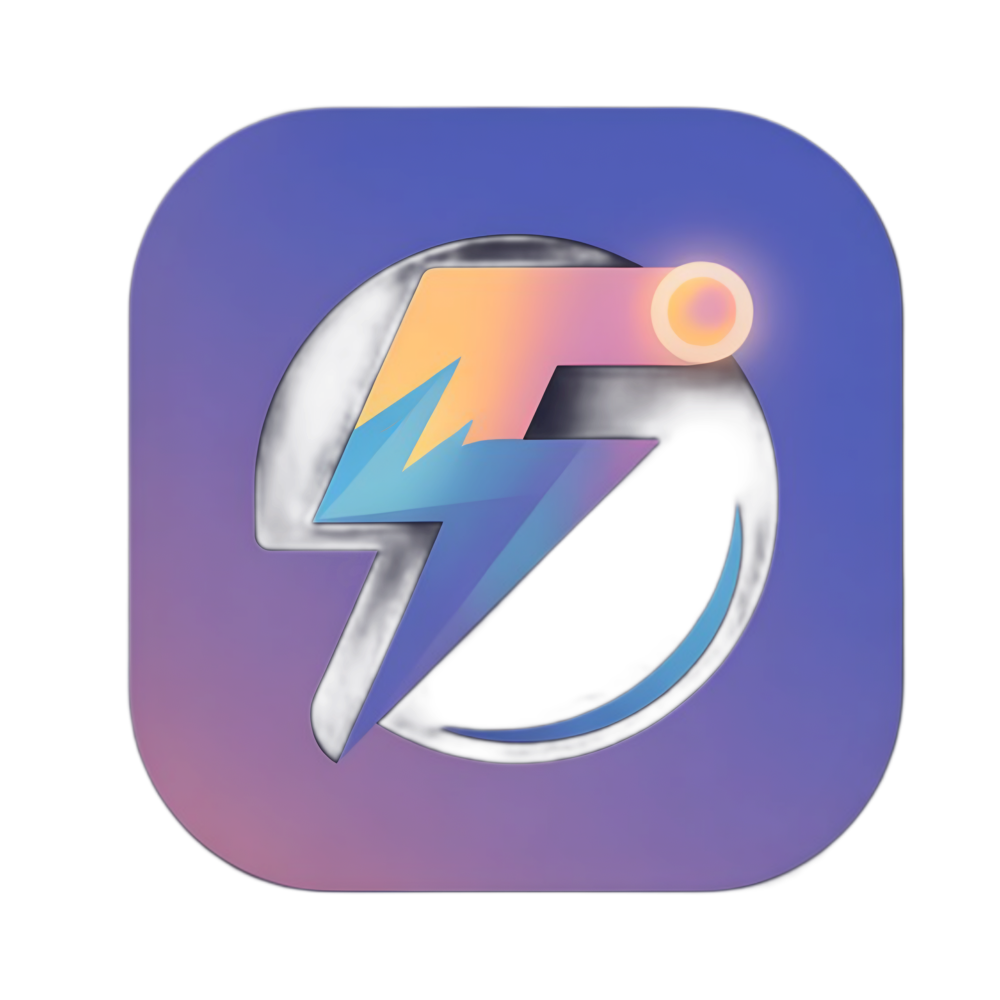<br>Focusnyx</p>

<p align="center">
  <strong>The Ultimate Student Life OS & Cognitive Shield</strong><br>
  <em>Empowering student productivity, academic momentum, and mental clarity through dual-layer dopamine detox and intelligent study systems.</em>
</p>

<p align="center">
  <a href="https://focusnyx.vercel.app"></a>
  <a href="https://github.com/mhjayeed715/Focusnyx/releases"></a>
  <a href="https://opensource.org/licenses/MIT"></a>
</p>

<p align="center">
  <a href="https://nextjs.org/"></a>
  <a href="https://expressjs.com/"></a>
  <a href="https://supabase.com/"></a>
  <a href="https://developer.chrome.com/docs/extensions/mv3/intro/"></a>
  <a href="https://www.python.org/"></a>
</p>

---

## 📖 Table of Contents
- [🌟 Project Overview](#-project-overview)
- [⚡ ADHD Mode vs. Standard Mode](#-adhd-mode-vs-standard-mode)
- [🛠️ Key Features & Core Modules](#%EF%B8%8F-key-features--core-modules)
  - [1. Smart Academic Forge](#1-smart-academic-forge)
  - [2. Dopamine Detox Engine & Focus Lock](#2-dopamine-detox-engine--focus-lock)
  - [3. Smart Notes Vault with AI Quiz Generator](#3-smart-notes-vault-with-ai-quiz-generator)
  - [4. AI Behavioral Coach & Focusnyx AI Chatbot](#4-ai-behavioral-coach--focusnyx-ai-chatbot)
  - [5. Student Finance Tracker](#5-student-finance-tracker)
  - [6. Wellness Shield & Burnout Prevention](#6-wellness-shield--burnout-prevention)
  - [7. 3-Tier Productivity Analytics](#7-3-tier-productivity-analytics)
- [⚙️ System Architecture & Data Flows](#%EF%B8%8F-system-architecture--data-flows)
  - [High-Level Hybrid Architecture](#high-level-hybrid-architecture)
  - [Two-Way Real-Time Timer & Lock Synchronization](#two-way-real-time-timer--lock-synchronization)
- [🗄️ Database Schema (Supabase / PostgreSQL)](#%EF%B8%8F-database-schema-supabase--postgresql)
- [📂 Code Structure & Modular Design](#-code-structure--modular-design)
- [💻 Hardware Hooks & OS Permissions](#-hardware-hooks--os-permissions)
- [🚀 Quick Downloads & Installation Guide](#-quick-downloads--installation-guide)
  - [Direct Pre-Built Downloads](#direct-pre-built-downloads)
  - [Local Development Setup](#local-development-setup)
- [🤝 Contributing & Feedback](#-contributing--feedback)
- [📜 License](#-license)
- [👨‍💻 Author & Maintainer](#-author--maintainer)

---

## 🌟 Project Overview

**Focusnyx** is a full-stack **Student Life OS** and digital cognitive shield designed specifically for university students and neurodivergent learners. Operating as an interconnected hybrid ecosystem, it unifies:

1. **Progressive Web Application (PWA)**: Built with Next.js 14 App Router and Neo-Brutalist design tokens.
2. **Chrome Extension (Manifest V3)**: Provides browser-level URL blocking, declarative request filtering, and in-tab focus overlays.
3. **Windows Native Companion App**: A Python/Flask system tray service with low-level Win32 hooks to intercept shortcut keys (`Alt+Tab`, `Win`, `Ctrl+Esc`), manage window focus, and enforce distraction-free desktop environments.

Focusnyx balances rigorous time management with holistic student wellness, grade estimation, peer-to-peer finance tracking, continuous bilingual voice notes, and AI-powered personalized study assistance.

🌐 **Live Web Application**: [https://focusnyx.vercel.app](https://focusnyx.vercel.app)

<br>

<p align="center">
  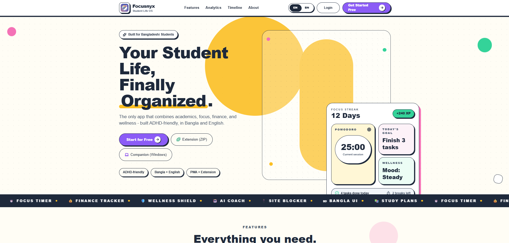
</p>

<p align="center">
  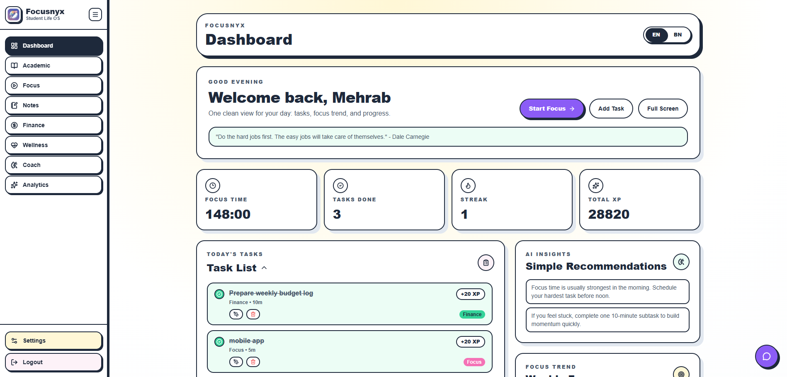
</p>

---

## ⚡ ADHD Mode vs. Standard Mode

Focusnyx features a global **ADHD / Standard Interaction Mode Switcher** accessible from the top navigation bar at all times.

| Core Feature | ⚡ ADHD Mode (Low Friction & Cognitive Ease) | 🏛️ Standard Mode (Comprehensive Detail) |
| :--- | :--- | :--- |
| **Academic Forge** | Top focal countdown banner for the single immediate deadline with 1-click study session launch. Historical semesters tucked into collapsible accordion. | Full semester overview, detailed course credit lists, SGPA projection sliders, and grading scale tables. |
| **Focus Workstation** | Prominently centered hyperfocus timer, single focal task with 1-tap subtasks, and pre-filled 25m/5m/50m presets. App blocklists tucked in drawer. | Full multi-tab blocklist managers, custom domain whitelist tables, ambient lo-fi sound mix consoles. |
| **Smart Notes Vault** | "⚡ Quick Brain Dump" prompt with instant 1-click voice dictation (EN/BN) and 1-tap 5-MCQ quiz presets. | Rich note editor, subject tag creation, custom question count sliders (MCQ, Short Q&A, Broad Essay). |
| **Finance Tracker** | 3 essential big numbers (Balance, Expenses, Budget) + 1-tap quick expense chips (`+৳50`, `+৳100`, `+৳500`). Collapsible debts/savings. | Full multi-category breakdown bars, interactive transaction history tables, savings goal deposit logs. |
| **Wellness Shield** | 1-tap daily quick check-in (`💧 +1 Glass Water`, `Mood Emojis`, `🏃 +1,000 Steps`) + bold single-card burnout meter. | Detailed bedtime/wake time forms, medication manager logs, multi-week sleep correlation charts. |
| **AI Behavioral Coach** | "⚡ ADHD Golden Action of the Week" hero banner with top 3 actionable bullet points. Collapsible deep report. | Full multi-paragraph AI behavioral diagnostic, metric breakdown chips, and complete historical reports. |
| **Analytics Overview** | 3-Core Focus Vitals (Today's Focus Mins, Distractions Blocked, Tasks Done) + single-day focus view. | 3-Tier Multi-Period Analytics (Daily, Weekly, Monthly) with CGPA momentum charts and sleep vs. focus correlations. |

---

## 🛠️ Key Features & Core Modules

### 1. Smart Academic Forge
- **CGPA & SGPA Momentum Calculator**: Input course credits, midterms, and finals to accurately project semester GPA and cumulative CGPA.
- **Immediate Focal Deadline Countdown**: ADHD-friendly countdown banner highlighting the next upcoming exam or assignment.
- **Course & Task Boards**: Organize academic deliverables with weighted subtasks and deadline prioritization.
- **Gamified XP & Level Progression**: Earn Experience Points (XP) for completed tasks, unlocking streak multipliers.

<p align="center">
  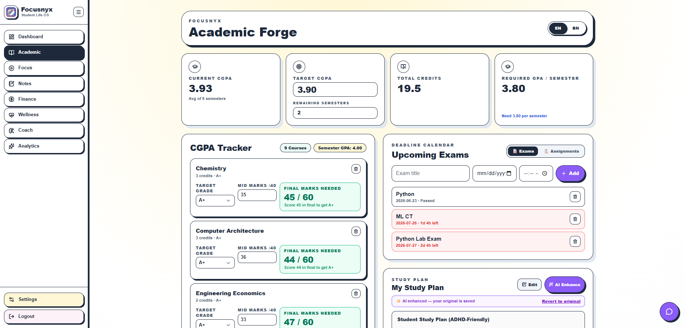
</p>

---

### 2. Dopamine Detox Engine & Focus Lock
- **Browser Lock (Chrome Extension Manifest V3)**: Intercepts distracting domain navigation, new tabs, and tab switches, redirecting to a motivation-focused block page.
- **Desktop Lockdown (Windows Companion)**: Intercepts distraction apps (games, social media, messaging) and brings study windows back to the foreground.
- **Shortcut Interception**: Blocks `Alt+Tab`, `Windows Key`, `Ctrl+Esc`, and disables Task Manager / Registry Editor during active sessions.
- **Strict 6-Digit Emergency Rescue PIN**: Prevents impulsive session termination. Locked with a strict 6-digit numeric validation modal.
- **Two-Way Synchronization**: Starting or stopping a timer in the Chrome Extension, Companion App, or Web App immediately updates all connected clients in real time.

<p align="center">
  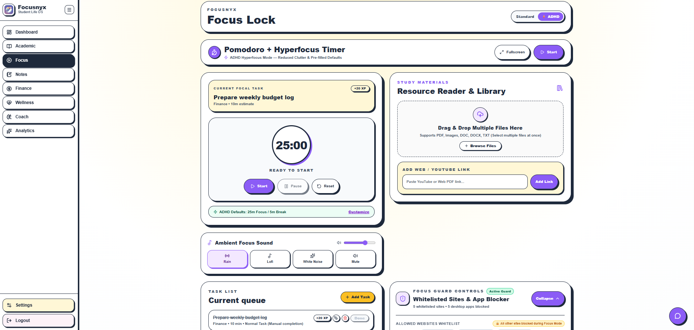
</p>

<p align="center">
  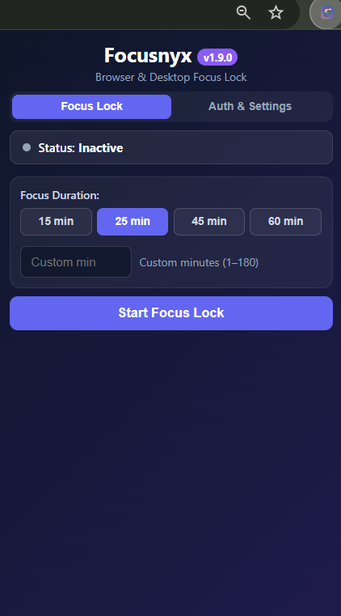
  &nbsp;&nbsp;&nbsp;&nbsp;
  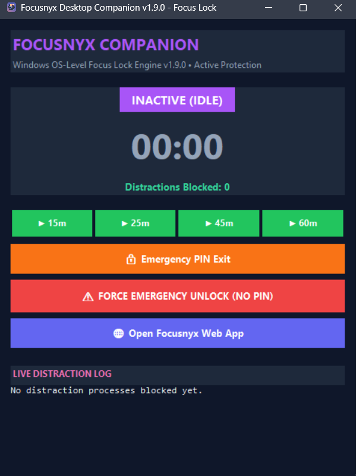
</p>

---

### 3. Smart Notes Vault with AI Quiz Generator
- **Continuous Bilingual Voice Dictation**: Hands-free live Speech-to-Text supporting **English (US)** and **Bangla (BD)** via the Web Speech API with automatic loop prevention.
- **AI Quiz Generator**: Generates custom practice sets from note contents via Llama-3.1 or Gemini:
  - **Interactive MCQs**: Instant score indicators, correct/incorrect visual feedback, and explanations.
  - **Short Q&A practice**: Flashcard-style conceptual checks.
  - **Broad Essay Questions**: University-style practice questions with comprehensive model answers.

<p align="center">
  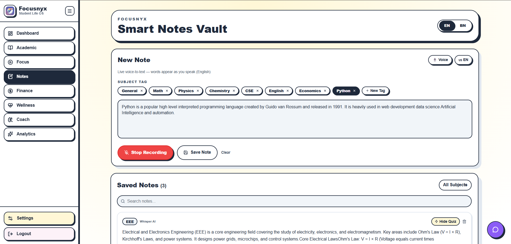
</p>
<p align="center">
  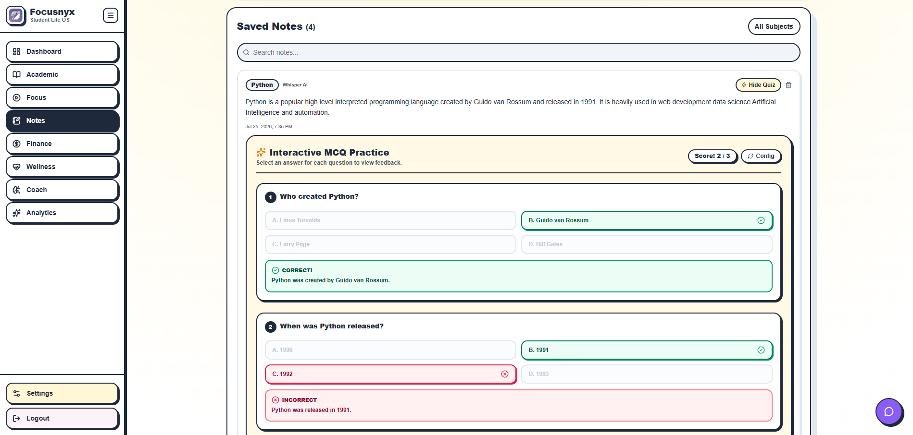
</p>

---

### 4. AI Behavioral Coach & Focusnyx AI Chatbot
- **Focusnyx AI Assistant**: Floating AI assistant available globally throughout the web app.
- **Knowledge Guardrails**: Strict system prompts ensure the AI focuses exclusively on study habits, academics, productivity, and Focusnyx features while declining off-topic prompts.
- **Dual Language Support**: Seamless interaction in both English and Bangla.
- **Free Tier Daily Quota & Custom Keys**: Free daily allowance (resetting according to Asia/Dhaka time) with optional BYOK (Bring Your Own Key) for unlimited Groq or Gemini queries.
- **Weekly Progress Report**: Aggregates focus sessions, distraction logs, wellness data, and task completions into personalized weekly action plans.

<p align="center">
  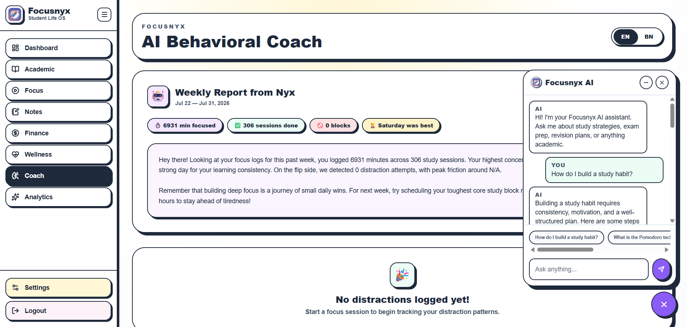
</p>

---

### 5. Student Finance Tracker
- **Ledger Management**: Record income and expense entries across student-focused categories (Food, Tuition, Books, Transport, etc.).
- **1-Tap Quick Expense Chips**: Pre-filled quick logging buttons for immediate recording without typing.
- **Peer Debt Tracker**: Track lent and borrowed money with friends and classmates.
- **Savings Goals**: Set visual targets for tuition, electronics, or emergency funds.

<p align="center">
  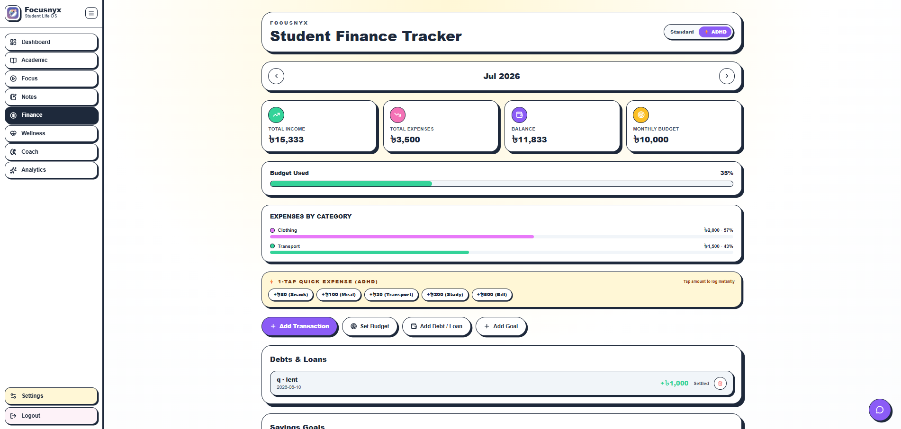
</p>

---

### 6. Wellness Shield & Burnout Prevention
- **1-Tap Quick Wellness Logger**: Log glasses of water, mood emojis, and step counts in a single click.
- **Burnout Shield**: Dynamically computes burnout risk scores based on sleep duration, hydration levels, study hours, and mood trends.
- **Study-Rest Balance Advisor**: Provides contextual recommendations when sleep or hydration levels drop below healthy thresholds.

<p align="center">
  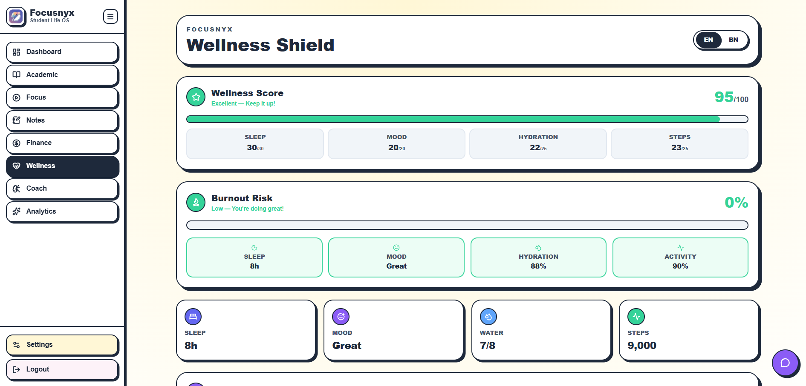
</p>

---

### 7. 3-Tier Productivity Analytics
1. **Tier 1 (Daily)**: Focus minutes by session, recorded distraction spikes, and task completion rates.
2. **Tier 2 (Weekly)**: Top blocked distraction categories, best focus day, and average sleep vs. study duration.
3. **Tier 3 (Monthly / Macro)**: CGPA momentum trajectory and monthly expense vs. budget adherence.

<p align="center">
  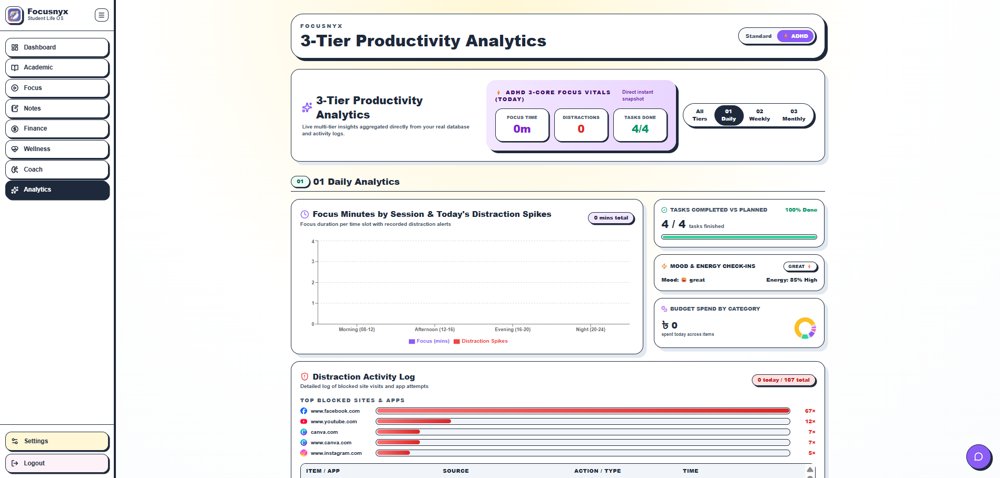
</p>
<p align="center">
  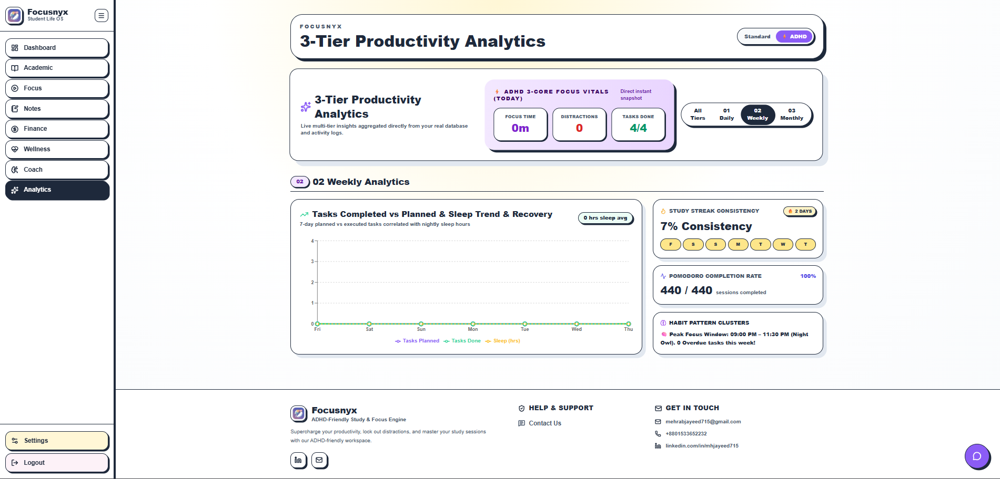
</p>
<p align="center">
  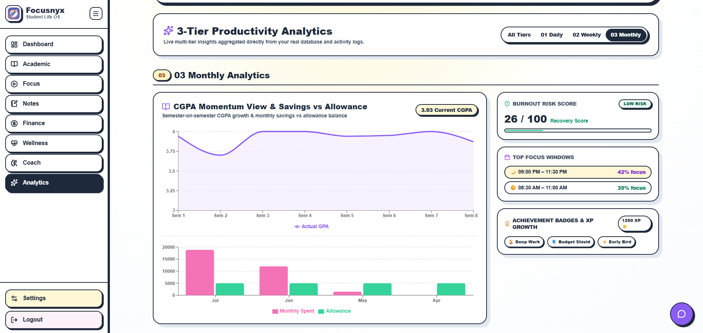
</p>

---

## ⚙️ System Architecture & Data Flows

### High-Level Hybrid Architecture

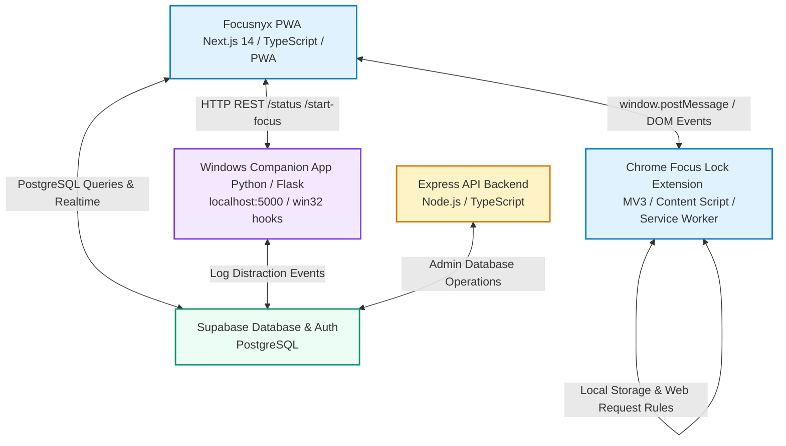
```mermaid
graph TD
    classDef client fill:#e0f2fe,stroke:#0284c7,stroke-width:2px;
    classDef os fill:#f3e8ff,stroke:#7c3aed,stroke-width:2px;
    classDef backend fill:#fef3c7,stroke:#d97706,stroke-width:2px;
    classDef db fill:#ecfdf5,stroke:#059669,stroke-width:2px;

    PWA[Focusnyx PWA <br> Next.js 14 / TypeScript / PWA]:::client
    Ext[Chrome Focus Lock Extension <br> MV3 / Content Script / Service Worker]:::client
    Comp[Windows Companion App <br> Python / Flask localhost:5000 / win32 hooks]:::os
    API[Express API Backend <br> Node.js / TypeScript]:::backend
    Supa[Supabase Database & Auth <br> PostgreSQL]:::db

    %% Real-time Sync & Interconnections
    PWA <-->|PostgreSQL Queries & Realtime| Supa
    PWA <-->|window.postMessage / DOM Events| Ext
    PWA <-->|HTTP REST /status /start-focus| Comp
    Ext <-->|Local Storage & Web Request Rules| Ext
    Comp <-->|Log Distraction Events| Supa
    API <-->|Admin Database Operations| Supa
```

---

### Two-Way Real-Time Timer & Lock Synchronization

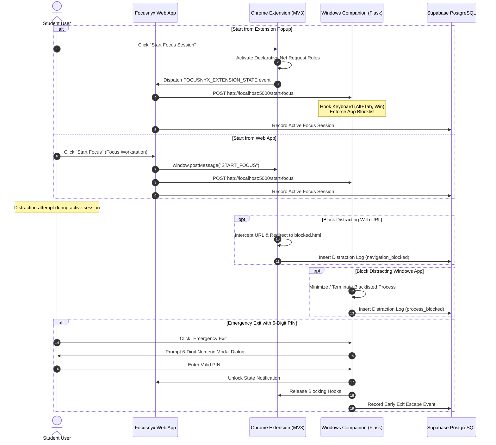
```mermaid
sequenceDiagram
    autonumber
    actor Student as Student User
    participant PWA as Focusnyx Web App
    participant Ext as Chrome Extension (MV3)
    participant Comp as Windows Companion (Flask)
    participant DB as Supabase PostgreSQL

    alt Start from Extension Popup
        Student->>Ext: Click "Start Focus Session"
        Ext->>Ext: Activate Declarative Net Request Rules
        Ext->>PWA: Dispatch FOCUSNYX_EXTENSION_STATE event
        PWA->>Comp: POST http://localhost:5000/start-focus
        Note over Comp: Hook Keyboard (Alt+Tab, Win)<br/>Enforce App Blocklist
        PWA->>DB: Record Active Focus Session
    else Start from Web App
        Student->>PWA: Click "Start Focus" (Focus Workstation)
        PWA->>Ext: window.postMessage("START_FOCUS")
        PWA->>Comp: POST http://localhost:5000/start-focus
        PWA->>DB: Record Active Focus Session
    end

    Note over Student: Distraction attempt during active session
    opt Block Distracting Web URL
        Ext->>Ext: Intercept URL & Redirect to blocked.html
        Ext->>DB: Insert Distraction Log (navigation_blocked)
    end
    opt Block Distracting Windows App
        Comp->>Comp: Minimize / Terminate Blacklisted Process
        Comp->>DB: Insert Distraction Log (process_blocked)
    end

    alt Emergency Exit with 6-Digit PIN
        Student->>Comp: Click "Emergency Exit"
        Comp->>Student: Prompt 6-Digit Numeric Modal Dialog
        Student->>Comp: Enter Valid PIN
        Comp->>PWA: Unlock State Notification
        Comp->>Ext: Release Blocking Hooks
        Comp->>DB: Record Early Exit Escape Event
    end
```

---

## 🗄️ Database Schema (Supabase / PostgreSQL)

Focusnyx utilizes a PostgreSQL schema managed via Supabase:

```
  ┌──────────────────┐          ┌───────────────────┐
  │     profiles     │◀─────────│  academic_tasks   │
  ├──────────────────┤          ├───────────────────┤
  │ id (PK, FK)      │          │ id (PK)           │
  │ university_email │          │ user_id (FK)      │
  │ display_name     │          │ title, subject    │
  │ total_xp, streak │          │ subtasks (jsonb)  │
  │ emergency_pin    │          │ due_at            │
  └──────────────────┘          └───────────────────┘
           ▲
           │                    ┌───────────────────┐
           ├───────────────────│       notes       │
           │                    ├───────────────────┤
           │                    │ id (PK)           │
           │                    │ user_id (FK)      │
           │                    │ subject, content  │
           │                    │ source (voice/type)│
           │                    └───────────────────┘
           │
           │                    ┌───────────────────┐
           ├───────────────────│  focus_sessions   │
           │                    ├───────────────────┤
           │                    │ id (PK)           │
           │                    │ user_id (FK)      │
           │                    │ started_at, end   │
           │                    │ planned_minutes   │
           │                    └───────────────────┘
           │
           │                    ┌───────────────────┐
           └───────────────────│ distraction_logs  │
                                ├───────────────────┤
                                │ id (PK)           │
                                │ user_id (FK)      │
                                │ domain, type      │
                                │ details (jsonb)   │
                                └───────────────────┘
```

---

## 📂 Code Structure & Modular Design

```
Focusnyx/
├── backend/                  # REST API server (Express / TypeScript)
│   ├── src/
│   │   ├── config/           # App configuration and environment loaders
│   │   ├── controllers/      # Route controllers (academic, wellness, finance)
│   │   ├── middleware/       # JWT authentication & error handlers
│   │   └── routes/           # Domain-split REST routers
│   └── supabase/             # Database migration and schema.sql
│
├── frontend/                 # Progressive Web Application (Next.js 14 App Router)
│   ├── public/               # Static icons, sounds, and downloadable ZIPs
│   │   └── downloads/        # Packaged Extension & Companion executables
│   └── src/
│       ├── app/              # App router pages (/academic, /focus, /notes, /finance, etc.)
│       ├── components/       # Neo-Brutalist modular UI components
│       ├── context/          # Global FocusContext and Language/ADHD Mode context
│       └── lib/              # Supabase client, AI Groq/Gemini integrations
│
├── extension/                # Focus Lock Chrome Extension (Manifest V3)
│   ├── manifest.json         # Extension configuration (v1.9.0)
│   ├── blocked.html          # Custom redirect block page
│   └── src/
│       ├── background/       # Service worker & declarative net request logic
│       ├── content/          # Content script & DOM overlay bridges
│       └── popup/            # Extension popup GUI with status controls
│
└── companion/                # Windows Focus Lock Companion App (Python 3.9+)
    ├── focusnyx_companion.py # System tray, Flask localhost API, Tkinter GUI (v1.9.0)
    ├── keyboard_blocker.py   # Windows low-level keyboard interception
    ├── registry_manager.py   # Task Manager & Registry lockdown
    ├── process_monitor.py    # Native process scanner and app blocker
    ├── window_manager.py     # Win32 window always-on-top manager
    └── package_zip.py        # Automated PyInstaller & ZIP packaging script
```

---

## 💻 Hardware Hooks & OS Permissions

| Component | Target System | Hook Mechanism | Permissions Required |
| :--- | :--- | :--- | :--- |
| **PWA Web App** | Web Browsers / Mobile | Service Workers, Web Speech API | Microphone, Notifications |
| **Chrome Extension** | Chrome / Edge / Brave | `declarativeNetRequest`, `webNavigation`, `storage` | `tabs`, `storage`, `<all_urls>` |
| **Companion App** | Windows 10 & 11 | `win32gui`, `win32process`, `keyboard`, `ctypes` | Windows Administrator (UAC Elevated) |

---

## 🚀 Quick Downloads & Installation Guide

### Direct Pre-Built Downloads

You can download the pre-compiled packages directly:
- 📦 **Chrome Extension (`v1.9.0`)**: Available directly from the web app at `https://focusnyx.vercel.app/downloads/Focusnyx-Chrome-Extension.zip`
- 🖥️ **Windows Desktop Companion (`v1.9.0`)**: Available directly from the web app at `https://focusnyx.vercel.app/downloads/FocusnyxCompanionApp-Windows.zip`

---

### Local Development Setup

#### Prerequisites
- [Node.js v18+](https://nodejs.org/en)
- [Python v3.9+](https://www.python.org/) (for Windows Companion development)
- [Git](https://git-scm.com/)

#### 1. Clone the Repository
```bash
git clone https://github.com/mhjayeed715/Focusnyx.git
cd Focusnyx
```

#### 2. Database Setup (Supabase)
1. Create a project at [Supabase](https://supabase.com/).
2. Open the **SQL Editor** in your Supabase Dashboard and run the contents of [`backend/supabase/schema.sql`](file:///e:/Users/Desktop/AI%20PROJECT/Focusnyx/backend/supabase/schema.sql).

#### 3. Frontend Setup (PWA)
```bash
cd frontend
cp .env.example .env.local
# Set NEXT_PUBLIC_SUPABASE_URL and NEXT_PUBLIC_SUPABASE_ANON_KEY in .env.local
npm install
npm run dev
```
Open [http://localhost:3000](http://localhost:3000) in your browser.

#### 4. Chrome Extension Setup
1. Open `chrome://extensions/` in Chrome or Edge.
2. Enable **Developer mode** (top-right).
3. Click **Load unpacked** and select the `extension` folder.

#### 5. Windows Companion Setup
```bash
cd companion
pip install -r requirements.txt
python focusnyx_companion.py
```
*To build the standalone Windows executable:*
```bash
build_exe.bat
```

---

## 🤝 Contributing & Feedback

Contributions, issues, and feature requests are warmly welcomed!  
Feel free to open an issue or submit a pull request on the [GitHub Repository](https://github.com/mhjayeed715/Focusnyx).

1. **Fork** the Repository
2. **Create** your Feature Branch (`git checkout -b feature/AmazingFeature`)
3. **Commit** your Changes (`git commit -m 'Add some AmazingFeature'`)
4. **Push** to the Branch (`git push origin feature/AmazingFeature`)
5. **Open** a Pull Request

---

## 📜 License

Distributed under the **MIT License**. See [`LICENSE`](file:///e:/Users/Desktop/AI%20PROJECT/Focusnyx/LICENSE) for details.

```text
MIT License
Copyright (c) 2026 S. M. Mehrab Hossain Jayeed
```

---

## 👨‍💻 Author & Maintainer

**S. M. Mehrab Hossain Jayeed**  
🎓 *Developed as part of an academic initiative for student productivity, cognitive wellness, and neurodivergent study support.*

- 🔗 **GitHub Profile**: [@mhjayeed715](https://github.com/mhjayeed715)
- 📌 **Repository**: [https://github.com/mhjayeed715/Focusnyx](https://github.com/mhjayeed715/Focusnyx)
- 🌐 **Live Web Application**: [https://focusnyx.vercel.app](https://focusnyx.vercel.app)

---

<p align="center">
  <sub style="color: #888;">Dedicated to Stella.</sub>
</p>
